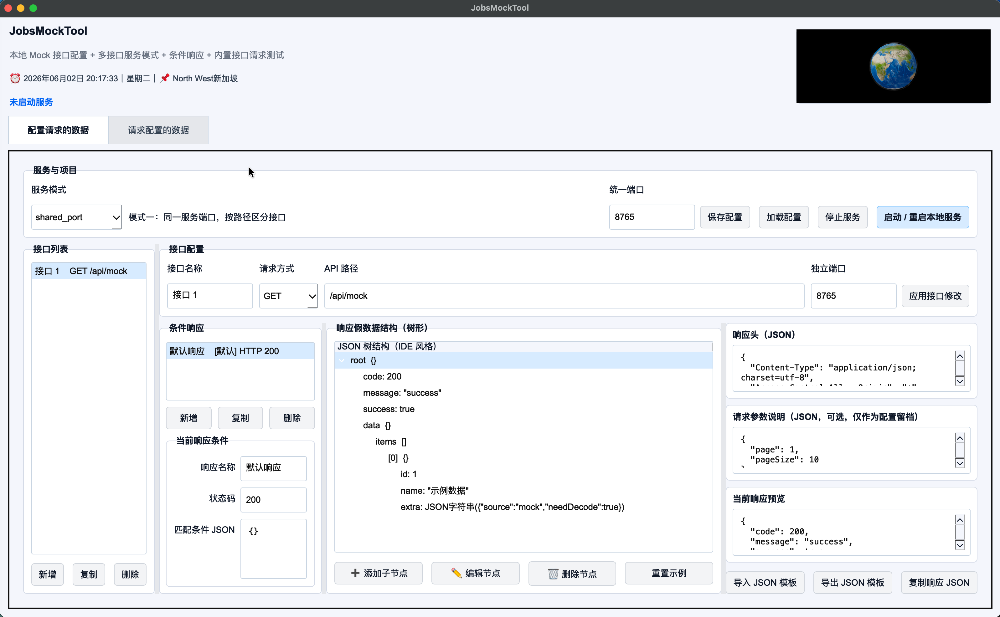
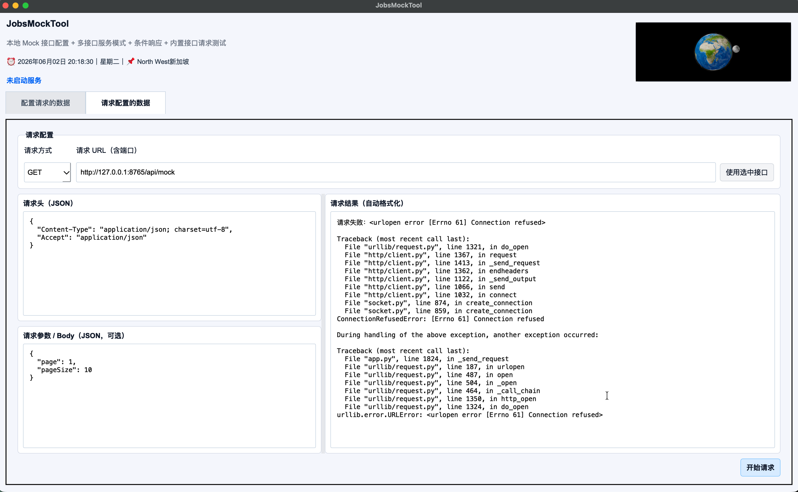

# `JobsMockTool`


[toc]

---

## 🔥 <font id=前言>前言</font>

`JobsMockTool` 是一个基于 [**Python**](https://www.python.org) + [**PySide6**](https://doc.qt.io/qtforpython-6/) 的本地 Mock API 桌面工具。

它不是一个只返回固定 JSON 的小脚本，而是一个面向前端、客户端、脚本调试、本地联调的轻量假后端工具：打开 App，配置接口、配置参数、配置假数据、启动本地服务，然后你的程序就可以直接请求本机返回的 Mock 数据。

项目已经合并四类需求：

- 第一类：原始基础需求。

  包括图形化界面、HTTP 请求方式配置、API 路径配置、请求头、请求参数、可视化假数据结构、本地服务启动、内置 Postman 式请求测试、macOS `.dmg` 和 Windows `.exe` 打包。

- 第二类：多接口与条件响应增强需求。

  包括多接口配置、双服务模式、状态码配置、条件响应、Mock 配置保存 / 加载、JSON 模板导入 / 导出。

- 第三类：`JobsMockTool` 品牌化与顶部 3D 展示区。

  程序名称统一改为 `JobsMockTool`，顶部右侧集成可拖拽 3D Earth 展示区，加载地址为：

  ```text
  https://dragonir.github.io/3d/#/earth
  ```

- 第四类：界面细节与自适应修正。

  程序界面不再显示版本号；顶部使用 `⏰` 和 `📌` 展示当前时间、星期和人类可读位置；选项卡强制左侧对齐；右上角 3D 展示区宽度缩小到上一版的 1/2，并保持右边界不变；请求页和配置页里的文本框改为随窗口尺寸自适应伸缩；主窗口增加最低宽高兜底，并扩大到 `1600 × 960`，保证最低尺寸下仍能显示完整功能界面，避免外层黑框裁切内部面板。

---

## 一、项目目标 <a href="#前言" style="font-size:17px; color:green;"><b>🔼</b></a> <a href="#🔚" style="font-size:17px; color:green;"><b>🔽</b></a>

### 1.1、核心目的

这个程序用于在本机启动一个可配置的 Mock Server，让当前机器临时变成一台“自己的接口服务器”。

典型流程：

1. 打开 `JobsMockTool`。
2. 在 `配置请求的数据` 选项卡里配置接口。
3. 配置 HTTP 方法、API 路径、端口、响应头、参数说明、响应数据。
4. 点击 `启动 / 重启本地服务`。
5. 在前端、客户端、浏览器、脚本或内置请求测试页里请求本机接口。
6. 接口返回你配置好的假数据。

示例：

```text
GET http://127.0.0.1:8765/api/users
```

### 1.2、解决的问题

开发过程中经常遇到这些问题：

- 后端接口还没开发完，前端或客户端无法联调。
- 后端接口不稳定，影响页面、App 或脚本调试。
- 某些异常状态码、边界数据、失败数据很难让真实后端配合返回。
- 只为了测一个接口，还要额外打开 Postman、Apifox 或写临时脚本。
- 普通 JSON 文件只能静态存数据，不能像真实服务器一样按路径、方法、参数返回。

`JobsMockTool` 的目的就是把这些事收口到一个桌面程序里。

---

## 二、功能总览 <a href="#前言" style="font-size:17px; color:green;"><b>🔼</b></a> <a href="#🔚" style="font-size:17px; color:green;"><b>🔽</b></a>





### 2.1、基础功能

| 功能 | 说明 |
| --- | --- |
| 图形化界面 | 打开程序后直接进入桌面 GUI，不需要手写服务脚本。 |
| HTTP 方法配置 | 支持 `GET`、`POST`、`PUT`、`PATCH`、`DELETE`、`OPTIONS`、`HEAD`。 |
| API 路径配置 | 支持配置 `/api/mock`、`/api/users`、`/api/orders` 等接口路径。 |
| 请求头配置 | 使用 JSON 文本配置响应头，默认带 `Content-Type` 和 CORS 相关头。 |
| 请求参数说明 | 可记录接口需要的参数结构，方便配置留档。 |
| 假数据配置 | 使用树形结构编辑最终返回的响应数据。 |
| 本地服务启动 | 点击按钮后在本机启动 HTTP Server。 |
| 内置请求测试 | 不需要再打开 Postman，可直接在第二个选项卡里请求测试。 |
| 响应格式化 | 请求结果会自动格式化 JSON，方便人工阅读。 |
| 跨平台打包 | 支持 Windows `.exe` 和 macOS `.app` / `.dmg` 打包脚本。 |

### 2.2、增强功能

| 功能 | 说明 |
| --- | --- |
| 多接口配置 | 可在同一个项目里维护多个 Mock 接口。 |
| 双服务模式 | 支持“同一端口按路径区分接口”和“每个接口独立端口”。 |
| 状态码配置 | 每个响应条件都可以配置自己的 HTTP 状态码。 |
| 条件响应 | 可根据 query、body、headers 参数返回不同假数据。 |
| 配置保存 / 加载 | 可把整个 Mock 项目保存为 JSON 文件，下次继续加载。 |
| JSON 模板导入 | 可导入现成 JSON，自动转换为树形结构。 |
| JSON 模板导出 | 可把当前树形响应导出为 JSON 文件。 |
| 复制响应 JSON | 可一键复制当前响应 JSON。 |
| 示例配置 | 内置 `./JobsMockTool/examples/sample_config_shared_port.json`。 |
| 3D 展示区 | 顶部右侧加载可拖拽 3D Earth 页面，宽度缩小到上一版的 1/2，右边界保持不变。 |
| 顶部时间位置 | 顶部左侧使用 `⏰` 显示本机当前时间和星期，使用 `📌` 显示自动识别的省市位置，不展示经纬度。 |
| 自适应布局 | 请求页、配置页文本框和结果区随窗口尺寸变化，内部框体不再按固定高度写死。 |
| 最小窗口兜底 | 主窗口设置最低宽高，防止向上压缩时外层黑框压住内部面板底部。 |

---

## 三、界面结构 <a href="#前言" style="font-size:17px; color:green;"><b>🔼</b></a> <a href="#🔚" style="font-size:17px; color:green;"><b>🔽</b></a>

### 3.1、顶部区域

顶部左侧显示：

- 程序名称：`JobsMockTool`
- 工具定位说明
- `⏰ 年月日 时分秒`
- 星期
- `📌 人类可读的位置`，例如 `四川省乐山市`，不展示经纬度
- 本地 Mock 服务状态

顶部右侧显示：

- 3D Earth 可拖拽展示区
- 加载地址：`https://dragonir.github.io/3d/#/earth`

注意：该区域是远程 WebGL 页面。如果当前电脑不能联网，或者系统 WebView 禁止加载远程内容，该区域可能显示为空或加载失败；Mock Server 功能不受影响。位置识别依赖网络 IP 信息，只做辅助展示，不参与 Mock 服务逻辑。

界面细节：顶部选项卡使用自定义左对齐栏，不再依赖系统默认 `QTabWidget` 的居中行为；主要文本区域交给布局系统联动，不再用固定高度硬撑。

### 3.2、配置请求的数据

这个页面负责生成本地接口服务。

主要区域：

| 区域 | 说明 |
| --- | --- |
| 服务模式 | 选择单端口多路径，或多接口独立端口。 |
| 统一端口 | 在“同一服务端口”模式下使用。 |
| 接口列表 | 展示当前项目下所有接口。 |
| 接口配置 | 配置接口名称、HTTP 方法、路径、独立端口。 |
| 条件响应 | 一个接口下可以有多个响应分支。 |
| 匹配条件 | 用 JSON 配置命中条件。 |
| 状态码 | 配置该条件返回的 HTTP 状态码。 |
| 响应假数据结构 | 使用树形结构编辑最终响应数据。 |
| 请求头 | 配置接口返回时携带的响应头。 |
| 请求参数说明 | 用于记录接口参数，不参与强校验。 |
| 当前响应预览 | 实时查看树形数据生成后的 JSON。 |
| 启动服务按钮 | 启动或重启本地 Mock Server。 |

### 3.3、请求配置的数据

这个页面负责请求接口并查看结果，定位类似轻量 Postman。

支持：

- 选择请求方式。
- 填写请求 URL。
- 配置请求头 JSON。
- 配置请求参数 / Body JSON。
- 点击 `开始请求`。
- 查看 HTTP 状态码、响应头、响应体。
- 自动格式化 JSON 响应。

对于 `GET` 请求，请求参数会拼接到 query string。

对于非 `GET` 请求，请求参数会作为 JSON Body 发送。

### 3.4、窗口缩放与自适应

界面内部的文本框、结果区和树形结构区域采用自适应布局：

- 拖动 App 外框变大时，内部编辑区同步扩展。
- 拖动 App 外框变小时，内部区域会先压缩到最小可用高度。
- 达到最低可用高度后，窗口不再继续变小；当前最低尺寸为 `1600 × 960`，目标是保证完整功能区可见。
- 请求头、请求参数、请求结果三个区域不再使用过高的固定尺寸。
- 配置页的响应头、参数说明、响应预览也跟随窗口变化。
- `匹配条件 JSON` 输入框改为固定可用高度，并给当前响应条件面板保留底部安全距离，避免和外层框线重合。

---

## 四、Mock 数据结构设计 <a href="#前言" style="font-size:17px; color:green;"><b>🔼</b></a> <a href="#🔚" style="font-size:17px; color:green;"><b>🔽</b></a>

### 4.1、为什么用树形结构

程序里的数据容器本质只有两类：

| 类型 | 对应 JSON |
| --- | --- |
| 字典 | JSON Object |
| 数组 | JSON Array |

所以 `JobsMockTool` 使用树形结构编辑假数据：

- 原点是 `root`。
- `dict` 和 `list` 可以继续添加子节点。
- 裸数据是叶子节点，不能继续往下扩展。

### 4.2、支持的数据类型

| 类型 | 含义 | 是否可继续添加子节点 |
| --- | --- | --- |
| `dict` | 字典 / JSON Object | 是 |
| `list` | 数组 / JSON Array | 是 |
| `string` | 字符串 | 否 |
| `number` | 数字 | 否 |
| `boolean` | 布尔值 | 否 |
| `null` | 空值 | 否 |
| `object_json_string` | 对象 JSON 字符串，调用方需要二次解码 | 否 |

### 4.3、对象字符串说明

有些业务里“对象数据”并不直接作为 JSON Object 返回，而是作为字符串返回给调用方二次解码。

这类数据可以使用：

```text
object_json_string
```

示例值：

```json
{"source":"mock","needDecode":true}
```

最终响应里会保持为字符串，不会展开成对象。

---

## 五、服务模式 <a href="#前言" style="font-size:17px; color:green;"><b>🔼</b></a> <a href="#🔚" style="font-size:17px; color:green;"><b>🔽</b></a>

### 5.1、模式一：同一端口，按路径区分接口

适合大多数本地联调场景。

示例：

```text
GET  http://127.0.0.1:8765/api/users
POST http://127.0.0.1:8765/api/orders
GET  http://127.0.0.1:8765/api/profile
```

优点：

- 只启动一个端口。
- 更接近普通后端服务。
- 前端只需要配置一个 baseURL。

### 5.2、模式二：每个接口独立端口

适合你想模拟多个服务、多个微服务、多个本地接口来源的场景。

示例：

```text
GET  http://127.0.0.1:8765/api/users
POST http://127.0.0.1:8766/api/orders
GET  http://127.0.0.1:8767/api/profile
```

优点：

- 每个接口可以单独占用端口。
- 适合模拟多个服务来源。
- 方便做服务拆分场景测试。

---

## 六、条件响应 <a href="#前言" style="font-size:17px; color:green;"><b>🔼</b></a> <a href="#🔚" style="font-size:17px; color:green;"><b>🔽</b></a>

### 6.1、默认响应

匹配条件为空对象时，表示默认响应：

```json
{}
```

当没有任何条件响应命中时，程序会返回默认响应。

### 6.2、按普通参数匹配

请求参数里带 `type=vip` 时命中：

```json
{
  "type": "vip"
}
```

### 6.3、按 query 匹配

```json
{
  "query.page": 2
}
```

### 6.4、按 body 匹配

```json
{
  "body.count": 0
}
```

### 6.5、按 headers 匹配

```json
{
  "headers.Authorization": "Bearer token"
}
```

### 6.6、状态码配置

每个条件响应都可以配置自己的 HTTP 状态码。

示例：

| 场景 | 状态码 |
| --- | --- |
| 正常成功 | `200` |
| 创建成功 | `201` |
| 参数错误 | `400` |
| 未登录 | `401` |
| 无权限 | `403` |
| 服务异常 | `500` |

---

## 七、保存 / 加载 / 导入 / 导出 <a href="#前言" style="font-size:17px; color:green;"><b>🔼</b></a> <a href="#🔚" style="font-size:17px; color:green;"><b>🔽</b></a>

### 7.1、保存完整配置

点击 `保存配置` 后，会导出完整 Mock 项目 JSON。

包含：

- 程序名
- 版本
- 服务模式
- 统一端口
- 接口列表
- 每个接口的条件响应
- 每个响应的树形数据结构

默认文件名：

```text
jobs_mock_tool_config.json
```

### 7.2、加载完整配置

点击 `加载配置` 后，选择之前保存的 JSON 文件即可恢复完整项目。

加载配置会停止当前服务，避免旧服务和新配置混在一起。

### 7.3、导入 JSON 模板

如果你已经有一段 JSON 响应，可以点击 `导入 JSON 模板`。

程序会自动把 JSON 转成树形结构。

### 7.4、导出 JSON 模板

点击 `导出 JSON 模板`，可以把当前树形响应导出成标准 JSON 文件。

---

## 八、运行源码 <a href="#前言" style="font-size:17px; color:green;"><b>🔼</b></a> <a href="#🔚" style="font-size:17px; color:green;"><b>🔽</b></a>

### 8.1、安装依赖

```shell
cd ./JobsMockTool
python3 -m venv .venv
source .venv/bin/activate
python -m pip install --upgrade pip
pip install -r requirements.txt
```

### 8.2、启动程序

```shell
cd ./JobsMockTool
python app.py
```

Windows 下：

```bat
cd JobsMockTool
python app.py
```

---

## 九、macOS 打包与安装 <a href="#前言" style="font-size:17px; color:green;"><b>🔼</b></a> <a href="#🔚" style="font-size:17px; color:green;"><b>🔽</b></a>

### 9.1、打包命令

必须在 macOS 上执行：

```shell
chmod +x ./【MacOS】📦生成dmg.command
./【MacOS】📦生成dmg.command
```

产物位置：

```text
./JobsMockTool/dist/JobsMockTool.app
./JobsMockTool/dist/JobsMockTool-Installer.dmg
```

### 9.2、安装方式

1. 双击 `JobsMockTool-Installer.dmg`。
2. 把 `JobsMockTool.app` 拖到 `Applications`。
3. 以后从 Launchpad 或应用程序目录启动。

### 9.3、首次打开被拦截

内部未签名版本可能被 macOS Gatekeeper 拦截。

处理方式：

1. 打开 `系统设置`。
2. 进入 `隐私与安全性`。
3. 找到 `JobsMockTool` 被拦截提示。
4. 点击 `仍要打开`。

正式分发时，需要 Apple Developer 签名和 notarization 公证。

---

## 十、Windows 打包 <a href="#前言" style="font-size:17px; color:green;"><b>🔼</b></a> <a href="#🔚" style="font-size:17px; color:green;"><b>🔽</b></a>

### 10.1、打包命令

必须在 Windows 上执行：

```bat
【Windows】📦生成exe.bat
```

产物位置：

```text
JobsMockTool\dist\JobsMockTool\JobsMockTool.exe
```

### 10.2、为什么不是单文件 exe

本版本集成了 Qt WebEngine，用于显示顶部 3D Earth 页面。Qt WebEngine 依赖 Chromium 相关资源，强行打成单文件 exe 容易出现运行时资源缺失。

所以 Windows 默认使用 `onedir` 模式：

```text
JobsMockTool\dist\JobsMockTool\JobsMockTool.exe
```

分发时请把整个 `JobsMockTool\dist\JobsMockTool` 文件夹一起发出去，不要只拷贝单独的 `JobsMockTool.exe`。

---

## 十一、依赖说明 <a href="#前言" style="font-size:17px; color:green;"><b>🔼</b></a> <a href="#🔚" style="font-size:17px; color:green;"><b>🔽</b></a>

当前依赖：

```text
PySide6>=6.7
pyinstaller>=6.0
```

说明：

| 依赖 | 用途 |
| --- | --- |
| `PySide6` | 桌面 GUI 和顶部 3D WebView。 |
| `pyinstaller` | 打包成 macOS `.app` / `.dmg` 和 Windows `.exe`。 |

相比早期 Tkinter 版本，本版本为了真正把网页 3D Earth 集成到窗口里，引入了 `PySide6` 和 Qt WebEngine。

---

## 十二、常见问题 <a href="#前言" style="font-size:17px; color:green;"><b>🔼</b></a> <a href="#🔚" style="font-size:17px; color:green;"><b>🔽</b></a>

### 12.1、顶部 3D 地球不显示

可能原因：

- 当前电脑不能访问互联网。
- 目标网页暂时无法访问。
- Qt WebEngine 组件没有正确安装。
- 打包时没有收集完整 `PySide6` 资源。

处理方向：

```shell
cd ./JobsMockTool
pip install -r requirements.txt
python app.py
```

如果源码运行正常，但打包后不显示，重点检查打包命令里是否包含：

```text
--collect-all PySide6
```

### 12.2、端口启动失败

说明端口被其他程序占用了。

解决方式：

- 换一个端口。
- 关闭占用端口的程序。
- 在“每个接口独立端口”模式下检查是否有端口重复。

### 12.3、接口返回 404

说明请求路径没有配置。

检查：

- 请求方式是否一致。
- API 路径是否一致。
- 是否已经点击 `启动 / 重启本地服务`。

### 12.4、接口返回 405

说明路径存在，但请求方式不匹配。

例如你配置的是：

```text
POST /api/orders
```

但请求的是：

```text
GET /api/orders
```

### 12.5、条件响应没有命中

检查匹配条件 JSON。

推荐从简单条件开始：

```json
{
  "type": "vip"
}
```

确认命中后，再改成更精确的：

```json
{
  "body.type": "vip"
}
```

---

## 十三、风险说明 <a href="#前言" style="font-size:17px; color:green;"><b>🔼</b></a> <a href="#🔚" style="font-size:17px; color:green;"><b>🔽</b></a>

- `JobsMockTool` 只监听 `127.0.0.1`，默认只服务本机请求。
- 不要把敏感 Token、真实密码、真实用户隐私数据写进 Mock 配置文件。
- `.dmg` 内部使用版未签名，正式分发需要签名和公证。
- Windows 版集成 Qt WebEngine，产物体积会明显大于 Tkinter 版。
- 顶部 3D Earth 是远程网页内容，是否可显示取决于网络和 WebView 环境。

---

## 十四、项目结构 <a href="#前言" style="font-size:17px; color:green;"><b>🔼</b></a> <a href="#🔚" style="font-size:17px; color:green;"><b>🔽</b></a>

```text
.
├── README.md
├── 【MacOS】📦生成dmg.command
├── 【Windows】📦生成exe.bat
└── JobsMockTool/
    ├── app.py
    ├── requirements.txt
    ├── JobsMockTool.spec
    ├── icon.png
    ├── assets/
    └── examples/
        └── sample_config_shared_port.json
```

| 文件 | 说明 |
| --- | --- |
| `./README.md` | 外层总说明文档，统一解释 macOS / Windows 打包入口。 |
| `./【MacOS】📦生成dmg.command` | macOS `.app` / `.dmg` 打包脚本。 |
| `./【Windows】📦生成exe.bat` | Windows `.exe` 打包脚本。 |
| `./JobsMockTool/app.py` | 主程序源码。 |
| `./JobsMockTool/requirements.txt` | Python 依赖。 |
| `./JobsMockTool/examples/sample_config_shared_port.json` | 多接口单端口示例配置。 |

---

## 十五、未执行声明 <a href="#前言" style="font-size:17px; color:green;"><b>🔼</b></a> <a href="#🔚" style="font-size:17px; color:green;"><b>🔽</b></a>

当前仓库可以在本机执行构建脚本，但不同系统的安装包必须在对应系统上打包：

- macOS `.app` / `.dmg` 必须在 macOS 上构建。
- Windows `.exe` 必须在 Windows 上构建。

如果在 Linux 环境里只能做源码静态检查，不能直接生成真正可运行的 macOS / Windows 安装包。

<a id="🔚" href="#前言" style="font-size:17px; color:green; font-weight:bold;">我是有底线的➤点我回到首页</a>
